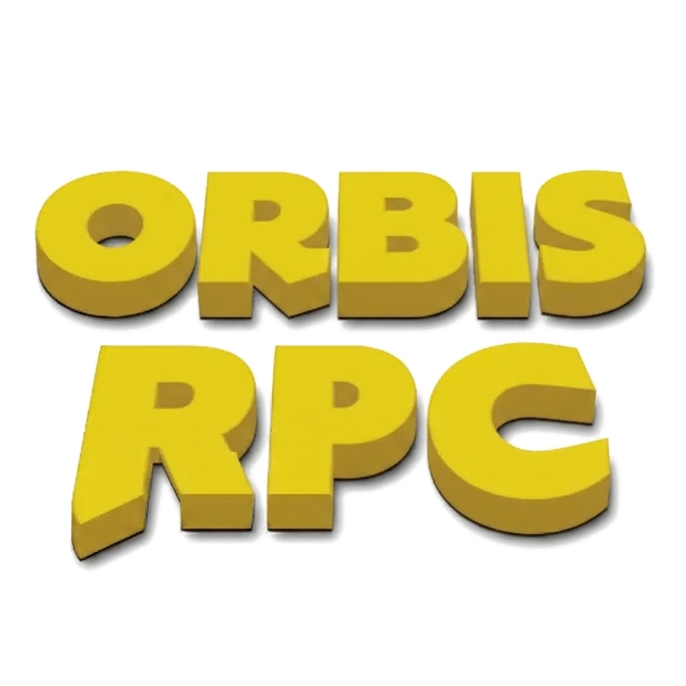

<p align="center">
  
</p>

# orbisRPC — Discord Rich Presence for PS4 (GoldHEN RPC)

<p align="center">
  <a href="https://github.com/SirHumza/orbisRPC/releases"></a>
  <a href="https://github.com/SirHumza/orbisRPC/actions/workflows/ci.yml"></a>
  
  
  <a href="https://discord.gg/BWEyfcT7ZQ"></a>
  
</p>

<p align="center">by <b>SirHumza & CyberMask367</b> · <a href="https://discord.gg/BWEyfcT7ZQ">discord.gg/BWEyfcT7ZQ</a></p>

<p align="center"><b>Discord Rich Presence for the jailbroken PS4 — every game, zero setup.</b><br>
A background daemon that lives entirely on your console and posts what you're
playing to Discord: name, cover art, timer. No PC at runtime.</p>

---

## Install (5 minutes)

> ⚠️ **No PKG — beta is `.elf` only.** Grab the latest test build
> (`orbisrpc_test-build-*.elf`) from the Discord
> (**[discord.gg/BWEyfcT7ZQ](https://discord.gg/BWEyfcT7ZQ)**). This is still
> a test build, not a full release — expect bugs, report them in
> `testers-chat`.

1. Before launching, delete the `/data/orbisRPC` folder from your PS4 if
   you have one there from an earlier build.
2. Run the payload first time — it'll create the config file, then say
   there's no token yet.
3. Open `/data/orbisRPC/config.json` and add your account token in the
   `"token": "SET_ME"` slot.
4. After setting the token, re-run the payload. Launch a game and watch
   Discord. Give feedback in `testers-chat`.

After a reboot just re-jailbreak and re-send the payload — don't use
Payload Guest for this.

**Auto-run (not recommended on test builds):** you can drop the `.elf` in
`/data/payloads` and add it to the autorun queue in GoldHEN settings, but
test builds change fast — stick to manual runs for now.

**Official release:** will ship a PKG installer that sets everything up
for you.
✅ Firmware: confirmed working on 9.00 through 13.52.

**Upgrading test builds:** as usual, delete the `/data/orbisRPC` folder
before using a new test build — and you'll have to re-add your token in
the config.

### What's in the latest test build (0.60)

- Fixed firmware string parsing — older firmware numbers like 9.00 now
  show properly.
- Homebrew apps resolve via pkg-zone.
- Retro games (PS1/PS2/PSP) resolve via a custom list.
- Optional presence flags, all `true` by default:
  `show_firmware`, `show_idle`, `show_media`, `show_homebrew`.

## Support / Community

Questions, test-build feedback, bug reports: join the Discord —
**[discord.gg/BWEyfcT7ZQ](https://discord.gg/BWEyfcT7ZQ)** — and post in
`testers-chat`. No need to hunt for the link; this is it.

**Found an issue?** Come to the Discord server and report it to us —
we'll take care of it.

⚠️ **This is a beta.** Test builds are handed out on the Discord — join the
server to get beta access.

**Game not showing on Discord?** It's your DNS blocker. Disable it, or use
[nanoDNS](https://github.com/drakmor/nanoDNS) with an exception.

To add the exception, open the nanoDNS config at
`/data/nanodns/nanodns.ini` and find the exceptions list:

```ini
[exceptions]
feature.api.playstation.com
.stun.playstation.net
stun..playstation.net
ena.net.playstation.net
post.net.playstation.net
gst.prod.dl.playstation.net
```

Add `tmdb.np.dl.playstation.net` so it looks like this:

```ini
[exceptions]
tmdb.np.dl.playstation.net
feature.api.playstation.com
.stun.playstation.net
stun..playstation.net
ena.net.playstation.net
post.net.playstation.net
gst.prod.dl.playstation.net
```

Once you're done, save and restart your console.

Also set your PS4's DNS to `127.0.0.1` so traffic actually goes through
nanoDNS — then reboot. (This is the step most people miss.)

**Still "can't connect to Discord" while the PS4 is online?**

1. Open the PS4 web browser and go to `discord.com` — if that doesn't load,
   it's your connection, not the payload.
2. Delete `/data/orbisRPC/log.txt`, restart the console, run the payload
   again.
3. If it still fails, send the new `log.txt` in `testers-chat`.

**Known issues (test build)**

- Some homebrew (Apollo Save Tool, Cheats Manager, Homebrew Store) isn't
  detected yet — under investigation.
- Hotspot/mobile connections can send oversized frames that Discord
  rejects — use stable Wi-Fi/LAN if presence won't set.

**Official release:** will ship a PKG installer that sets everything up
for you — including autorun and the nanoDNS exception fix.
## What you get

| | |
|---|---|
| 🎮 **Any game, no lists** | Names resolve from your console's metadata (SFO, app.xml) plus Sony's TMDB — CUSA, PPSA, indies, zero per-game setup. |
| 🖼️ **Real cover art** | Game art served per title, PlayStation logo when idle. |
| ⏱️ **True timers** | Survive reconnects and restarts, resume across quick game switches. |
| 🧠 **Self-learning** | First-seen titles are remembered, so later boots resolve instantly. |
| 🔄 **Self-updating** | Daemon updates land from GitHub releases with automatic rollback. No reinstall treadmill. |
| 📦 **Simple install** | Payload (`.elf`) install → token → presence. |

## How it works

```
PS4 (GoldHEN)                              Discord
┌─────────────────────────┐      ┌──────────────────┐
│ orbisRPC daemon         │ TLS  │  your profile    │
│  sandbox scan → game ID │ ◄──► │  Playing Game    │
│  metadata/TMDB → name   │      │  [cover] [timer] │
└─────────────────────────┘      └──────────────────┘
```

Details: [`docs/DAEMON.md`](docs/DAEMON.md) · [`docs/BUILDING.md`](docs/BUILDING.md) ·
[`docs/CONFIG.md`](docs/CONFIG.md) · [`docs/INSTALLER.md`](docs/INSTALLER.md) ·
[`docs/TROUBLESHOOTING.md`](docs/TROUBLESHOOTING.md) ·
[`docs/PRODUCTION.md`](docs/PRODUCTION.md) · full index at [`docs/`](docs/)

## Config

Only `token` (your Discord user session token) is required —
`/data/orbisRPC/config.json`. Everything else ships working.

| Key | Default | Meaning |
|---|---|---|
| `token` | — | Discord user session token (**required**) |
| `presence_state` | `"On PS4"` | Activity state line for games and the home screen |
| `presence_settings_text` | `"In Settings"` | Activity name while Settings is open |
| `poll_interval_s` | `12` | Detection cadence |
| `home_art` | project logo | Idle tile artwork (URL or uploaded asset key) |
| `pkgzone_enabled` | `true` | Ask pkg-zone.com for homebrew names — sends the title id to a third party; set `false` to disable |
| `retro_enabled` | `true` | Ask the retro-games indexes for PS1/PS2/PSP names and covers |
| `show_firmware` | `true` | Show the `Firmware X.YY` line |
| `show_idle` | `true` | Post a presence on the home screen, Settings and the browser |
| `show_media` | `true` | Post media apps (Netflix, YouTube, Plex…) as `Watching` |
| `show_homebrew` | `true` | Post homebrew titles. Retro classics are **not** affected |
| `debug` | `false` | Verbose per-poll logging |

A `false` visibility flag still detects the title — it just stops telling
Discord about it, so a game underneath keeps showing. The exception is the home
screen: with `show_idle` off, a game that closes is cleared rather than left up,
since nothing is running underneath there.

Plus the self-learned `titles` map, which fills itself in as titles resolve.

## Building

```bash
./scripts/build_sdk_from_source.sh   # SDK from git (REQUIRED - see note)
PS4_SDK_SRC=~/ps4-payload-sdk-src \
PS4_PAYLOAD_SDK=~/ps4-payload-sdk ./scripts/build_sdk.sh   # daemon payload
make -f installer/Makefile        # Setup PKG (OpenOrbis toolchain, llvmshim)
make -C tests test                # host unit tests
make -C tests asan                # ASan/UBSan
python3 tests/e2e_consumer.py     # contracts + linkage gate
```

⚠️ **Build the SDK from git, not the release ZIP.** The SDK's CRT refuses to
start on firmware it does not list, and terminates the payload before `main()`
with no log line. The released SDK (v0.9) lists 13.50 but not 13.52, so a
ZIP-built payload cannot boot on 13.52. See
[`docs/research/sdk-13.52.md`](docs/research/sdk-13.52.md).

## Safety

A user session token grants full account access — never share the config,
never commit a real token. Token-based presence is against Discord's ToS
(standard practice for headless presence tools; risk is yours).

## License

To be finalized (MIT vs GPL). No GPL source is copied into this tree.
